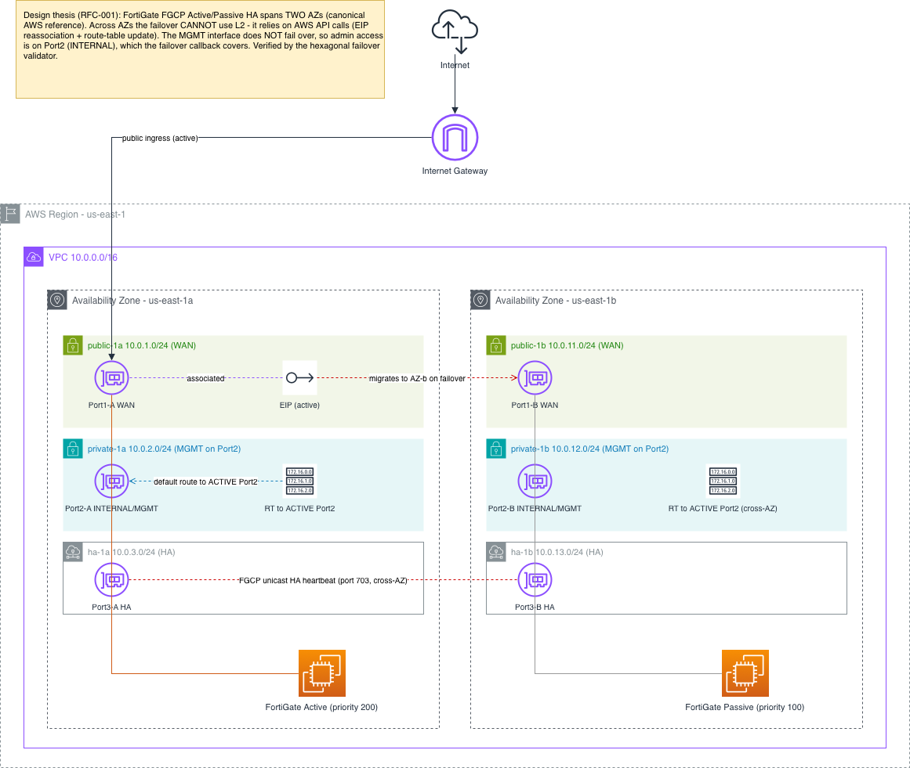

# High Level Design — FortiGate HA on AWS

> Diagram: [`docs/diagrams/02-HLD-fortigate-ha.drawio`](diagrams/02-HLD-fortigate-ha.drawio)
> (open in [diagrams.net](https://app.diagrams.net) to edit / export PNG)

---

## Design thesis (RFC-001)

In AWS, the FortiGate **MGMT interface does NOT fail over**. When the Passive node becomes Active,
management via MGMT is lost. The fix is to configure administrative access on **Port2 (INTERNAL)**,
which IS covered by the failover callback — EIP reassociation + route-table update via AWS API.

This project proves the thesis end-to-end: IaC deploys the cluster with Port2 as the management
interface; a hexagonal validator automatically verifies that Port2 remains reachable after failover.

Additionally, across two AZs the FGCP failover **cannot use L2** (AWS has no L2/multicast between
AZs). The failover is 100% API-driven — this makes the Port2 + API-callback pattern a hard
requirement, not an optional optimisation.

---

## Topology overview



**Key design points:**

- **Internet → IGW → Port1 (WAN):** Public ingress. EIP attached to **FGT-Active's Port1-A**. On failover, EIP migrates to Port1-B via `ec2:AssociateAddress`.

- **Port2 (INTERNAL/MGMT):** Management interface — RFC-001 requires it on Port2 (not MGMT), because MGMT has no failover coverage in AWS. Default route on private subnets (`private-1a`, `private-1b`) points to whichever node is **Active**. On failover, route-tables update via `ec2:ReplaceRoute`.

- **Port3 (HA heartbeat):** FGCP unicast heartbeat (UDP 703, cross-AZ). Mandatory unicast — AWS has no L2/multicast between AZs. Detects failure in ~3 seconds.

- **Two AZs (us-east-1a, us-east-1b):** FGT-Active (priority 200) in AZ-1a; FGT-Passive (priority 100) in AZ-1b. On Active failure → Passive becomes Active, all routes/EIP follow.

---

## Components

### CDK stacks (3)

| Stack | Resources | Purpose |
|---|---|---|
| **NetworkStack** | VPC, 6 subnets, IGW, route tables, 3 SGs | Network foundation |
| **FortiGateStack** | 2× EC2 `c6in.xlarge`, 6 ENIs, EIP, IAM role | HA pair |
| **WatchdogStack** | EventBridge rule (30 min), Lambda, CodeBuild | Auto-destroy |

### Network — VPC `10.0.0.0/16`

| Subnet | CIDR | AZ | Port | Purpose |
|---|---|---|---|---|
| public-1a | 10.0.1.0/24 | us-east-1a | Port1 | WAN / internet (Active) |
| private-1a | 10.0.2.0/24 | us-east-1a | Port2 | **Management** (Active) |
| ha-1a | 10.0.3.0/24 | us-east-1a | Port3 | HA heartbeat |
| public-1b | 10.0.11.0/24 | us-east-1b | Port1 | WAN / internet (Passive) |
| private-1b | 10.0.12.0/24 | us-east-1b | Port2 | **Management** (Passive) |
| ha-1b | 10.0.13.0/24 | us-east-1b | Port3 | HA heartbeat |

Route tables: the **private-1a** and **private-1b** tables both point `0.0.0.0/0` → Port2 of
whichever node is currently **Active**. On failover, the FortiGate callback calls
`ec2:ReplaceRoute` to update both tables to the new Active's Port2 ENI.

### Security Groups (3)

| SG | Inbound | Purpose |
|---|---|---|
| **sg-wan** | TCP 443, UDP 500/4500 from `0.0.0.0/0`; ICMP for health | Port1/WAN — public |
| **sg-mgmt** | TCP 443, TCP 22 from `adminCidr` CDK context var | Port2/MGMT — restricted |
| **sg-ha** | UDP 703, TCP 703 within VPC CIDR | Port3/HA heartbeat only |

### FortiGate instances

| Property | Value |
|---|---|
| Instance type | `c6in.xlarge` (4 vCPU / 8 GiB) — Fortinet recommended default |
| AMI | Dynamic lookup — owner `679593333241`, pattern `FortiGate-VM64-AWSONDEMAND*` |
| Licensing | PAYG (Marketplace). Accept terms in console before first deploy. |
| ENIs per instance | 3 (Port1 WAN, Port2 INTERNAL/MGMT, Port3 HA) — all `sourceDestCheck: false` |
| EIP | 1, attached to Port1-A. Migrates to Port1-B via `ec2:AssociateAddress` on failover. |
| HA mode | FGCP Active/Passive, **unicast** (mandatory in AWS — no L2/multicast) |
| HA priorities | Active = 200, Passive = 100 |
| Admin interface | **Port2** (RFC-001). `allowaccess https ssh` on port2. NOT on mgmt. |

### Watchdog (auto-destroy)

EventBridge rule fires at `rate(30 minutes)` → Lambda → CodeBuild project runs
`cdk destroy --all --force --ci`. Backup of the `trap cleanup EXIT` in `deploy-and-test.sh`.
Belt-and-suspenders: infra is always destroyed, even if the shell is killed.

---

## Failover sequence

```
1. FGT-Active fails (terminated / EC2 stop)
2. FGT-Passive detects loss of heartbeat on Port3 (unicast, ~3 s dead-detect)
3. FortiOS elects new Active, triggers AWS API callback:
   a. ec2:DisassociateAddress  — detach EIP from Port1-A
   b. ec2:AssociateAddress     — attach EIP to Port1-B  ← public traffic follows
   c. ec2:ReplaceRoute (×2)    — private-1a + private-1b route to Port2-B  ← mgmt follows
4. Hexagonal validator polls:
   - CloudQueryPort  → ec2:DescribeInstances (new Active node state)
   - ReachabilityPort → HTTPS GET :443 on Port2-B IP
   Invariants: EipMigrationInvariant + MgmtReachabilityInvariant must both pass → PASSED ✅
5. deploy-and-test.sh exits (trap triggers cdk destroy)
```

Detection to reachability target: **< 120 s** (NFR).

---

## IAM role (minimum permissions)

The FortiGate instance profile needs exactly 7 permissions to execute the failover callback:

```
ec2:AssociateAddress
ec2:DisassociateAddress
ec2:DescribeAddresses
ec2:DescribeInstances
ec2:DescribeInstanceStatus
ec2:DescribeNetworkInterfaces
ec2:ReplaceRoute
```

No `*` wildcards. Scoped to the VPC via resource conditions where possible.

---

## Key architectural decisions

| RFC | Decision | Why |
|---|---|---|
| RFC-001 | Admin on Port2 (INTERNAL), NOT on MGMT | MGMT interface has no failover coverage in AWS |
| RFC-002 | CDK TypeScript | Type-safe IaC, programmable asset (AMI lookup, CDK assertions) |
| RFC-003 | PAYG licensing | No friction for a short-lived lab; BYOL is cost-rational for production |
| RFC-004 | FGCP Active/Passive (not GWLB) | The MGMT-failover lesson only manifests in A/P FGCP |
| RFC-005 | Hexagonal validator | Enables TDD; domain logic is pure and fast to test without AWS |
| RFC-006 | Watchdog Lambda + bash trap | Dual cleanup — robust against shell kills and long test failures |
